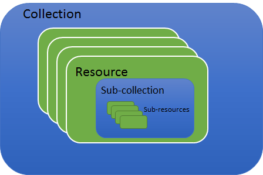

## REST introductie

REST staat voor **RE**presentational **S**tate **T**ransfer.

Een belangrijk concept binnen REST, zoniet het belangrijkste, is dat van een resource.
Een **resource** is een object dat gekenmerkt wordt door een bepaald type, zijn geassocieerde data, zijn relaties ten opzichte van andere resources en een verzameling operaties die kunnen worden uitgevoerd op de resource.
REST maakt zoveel mogelijk hergebruik van de bestaande faciliteiten van het HyperText Transfer Protocol (HTTP). Dit maakt dat binnen de REST style het aantal operaties beperkt is tot een set die overeen stemmen met de standaard HTTP methodes GET, PUT, POST, DELETE, PATCH, HEAD, OPTIONS. Dit omdat we REST steeds zien bovenop HTTP.

Resources van hetzelfde type kunnen worden gegroepeerd in een **collection**. Een collection bevat dus een set resources van hetzelfde
type en dit op een ongeordende manier. Belangrijk hierbij is dat de groepering van zulke resources in een collection geen must is. Resources kunnen immers ook als singleton bestaan.

Collections kunnen als top level element gedefinieerd zijn binnen een API, maar kunnen ook onderdeel uitmaken van een andere resource. In dit laatste geval spreken we van sub-resources en sub-collections. Zo ontstaat parent-child relationships tussen resources en collections.

Visueel voorgesteld ziet dit er als volgt uit:

Elke **resource** heeft zijn **representatie**. Een representatie bestaat uit een set attributen dewelke de **state** van de resource
omschrijven.

Het dataformaat waarin de resource representatie wordt voorgesteld wordt een **media-type** of MIME-type genoemd.