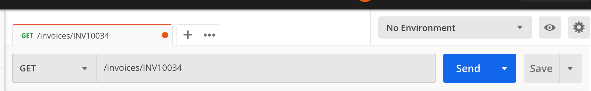
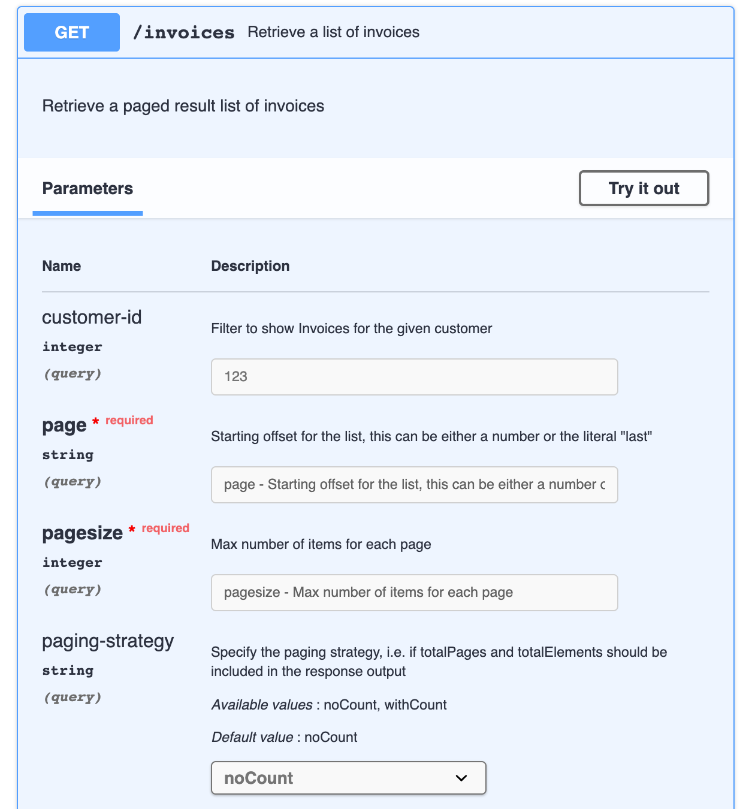
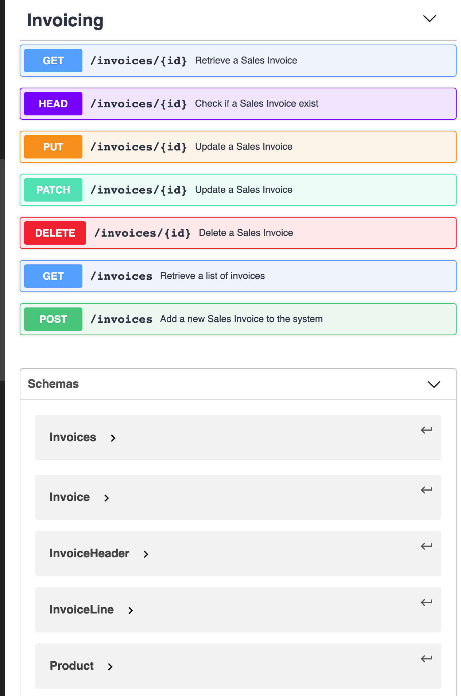

# API ontwerp

In dit hoofdstuk gaan we het voorbeeld uit de [Analyse voorbereiding](/content/designers/analysis) stuk voor stuk omzetten in een API. We maken stapsgewijs het OAS document op in het [YAML formaat](/content/designers/oas-yaml).

## Algemene API informatie

Dit is de header van je API waarin je een goede naam kiest. We gebruiken steeds zelfstandige naamwoorden en geen werkwoorden, bijvoorbeeld:

``` text
- Sales Invoice
- Users 
- Digital Asset Management
```

Merk op dat naam geen ‘API’ suffix heeft, we schrijven dus niet “Sales Invoice API”. Dit komt omdat API’s bij Digipolis gepubliceerd worden in een API marktplaats. Alles wat je daar ziet zijn dus API’s waardoor die extra aanduiding niet echt nodig is. Dit is vergelijkbaar met een zoekopdracht in Google, daar staat in de lijst ook niet achter elk item in de resultatenlijst dat het over een website gaat.

Naast de naam, heeft je API een versienummer nodig, hiervoor gebruiken we de [Semver 2](https://semver.org/) standard. Tijdens het ontwerpen (nog voor het effectief live gaan dus) werk je met versie `0.x.y`. Vanaf dat je de API effectief gaat publiceren, kan je gebruik maken van  major `1.x.y`.

```yaml
openapi: 3.0.0
info:
  version: '0.0.2'
  title: 'Sales Invoice'
  description: 'Create and manage Sales Invoices.....'
```

## Data modellen
De essentie van een API is dat het een stuk software is dat iets doet. Meestal is het beheren van specifieke data zoals het maken en opvragen van facturen of berekeningen allerlei maken.

Als we data willen opvragen van een REST API, dan krijgen we meestal data in de vorm van JSON terug.

Neem even het voorbeeld van een `Product` uit het analyse voorbeeld.

>[!NOTE|icon:fas fa-info-circle|label:Product Entiteit]
>```plantuml
>@startuml
>class Product{
>  omschrijving: string
>  eenheidsprijs: currency
>}
>@enduml
>```

Stel dat er 3 producten in het systeem zitten:

1. Computermuis, 35 €
2. Laptop, 800 €
3. LED Monitor, 200 €

In JSON zou dit er dan als volgt uit zien:

``` json
{
  "products": [
    {
      "description": "Computermuis",
      "unitprice": "35 EUR"
    },
    {
      "description": "Laptop",
      "unitprice": "800 EUR"
    },
    {
      "description": "LED Monitor",
      "unitprice": "200 EUR"
    },
  ]
}
```

Er zijn 3 setjes van data elks ontsloten door accolades wat aangeeft dat omschrijving en eenheidsprijs bij elkaar horen. Het geheel is ontsloten in vierkante haken wat aangeeft dat het over een lijst of verzameling gaat.

Een OAS document beschrijft de API, het is niet de API zelf. Dus in het OAS document gaan we de vorm van de data beschrijven en dus niet de data zelf. De vorm van bovenstaand Product entiteit beschrijven we aan de hand van een schema als volgt:

```yaml
components:
  schemas:
    Product:
      type: object
      properties:
        description:
          type: string
          description: The description of your product
          example: LED Monitor
        unitprice:
          type: string
          description: The price of the product for one SKU. This includes the currency symbol
          example: 30 EUR
```

Zoals je kan zien worden de schema’s van de data modellen genoteerd in het `components` gedeelte. Dit hoeft niet maar is wel aangewezen, zo kan je eenvoudiger het data model hergebruiken in verschillende scenario's. In het volgende voorbeeld maken we de `InvoiceLine` entiteit die een verwijzing heeft naar de `Product` entiteit.

```yaml
components:
  schemas:
    InvoiceLine:
      type: object
      properties:
        quantity:
          type: integer
          description: The number of products sold
          example: 1
        product:
          $ref: "#/components/schemas/Product"
    Product:
      type: object
      properties:
        description:
          type: string
          description: The description of your product
          example: LED Monitor
        unitprice:
          type: string
          description: The price of the product for one SKU. This includes the currency symbol
          example: 30 EUR
```

Zie je dat de `InvoiceLine` nu 2 properties heeft, één voor het aantal, en één voor het Product. Net zoals in het voorbeeld van onze analyse.


>[!NOTE|icon:fas fa-info-circle|label:Product Entiteit]
>```plantuml
>@startuml
>class Factuurlijn{
>  aantal: integer
>  product: Product
>}
>class Product{
>  omschrijving: string
>  eenheidsprijs: currency
>}
>Factuurlijn "0..*" o-down- "1" Product
>@enduml
>```

De `product` property van de `InvoiceLine` schema verwijst naar het eerder gedefinieerd product in plaats van dat hier nog eens te herhalen door middel van de $ref notatie.

Als laatste gaan we nog de `Invoice` entiteit zelf toevoegen aan de schema’s. Een factuur heeft één of meerdere factuurlijnen, deze verzameling wordt via een array opgezet in het OAS document:

``` yaml
components:
  schemas:
    Invoice:
      type: object
      properties:
        number:
          type: string
          description: A unique sequential invoice number, prefixed with 'INV'
          example: INV10034
        date:
          type: string
          format: date
          description: The date when this invoice was issued.
          example: 28-04-2020
        logo:
          type: string
          format: uri
          description: The logo that is available on the header of the invoice
          example: "s3.amazon.com/klj1002/logo.xyz.png"
        customer:
          type: object
          description: The customer for whom this is invoice is created
        invoiceLines:
          type: array
          items:
            $ref: "#/components/schemas/InvoiceLine"
    InvoiceLine:
      type: object
      properties:
        quantity:
          type: integer
          description: The number of products sold
          example: 1
        product:
          $ref: "#/components/schemas/Product"
    Product:
      type: object
      properties:
        description:
          type: string
          description: The description of your product
          example: LED Monitor
        unitprice:
          type: string
          description: The price of the product for one SKU. This includes the currency symbol
          example: 30 EUR
```

Merk op dat in het bovenstaande voorbeeld we ook een `klant` hebben toegevoegd aan de Invoice entiteit. Deze keer hebben we niet met een verwijzing gewerkt (`$ref`) maar met een klant object als onderdeel van het Invoice object. Dit is kan perfect, enigste probleem is dat we nu het schema van de klant niet kunnen hergebruiken.

>[!TIP|label:Onthoud]
> JSON is voor de data, YAML is voor het schema van deze data in het OAS document.

## Invoice resources opvragen

Nu we onze data gedefinieerd hebben, komt de volgende vraag, hoe haal ik deze uit de API uit?

Check even terug de [basics van dit document](/content/designers/basic-concepts) om de basis terug op te frissen.

Via de volgende operatie kan een afnemer een factuur opvragen uit onze API met nummer “INV10034”

``` http
GET /invoices/INV10034 HTTP/1.1
Content-Type: application/json
```

Nu deze instructies zijn redelijk technisch om steeds opnieuw in te voeren, vandaar dat het handig is om te werken met Postman. Via deze tool kan je op een visuele manier je vraag aan de API opstellen, deze vraag bewaren, etc.



Laten we deze operatie eens uitwerken in het `paths` blok van het OAS document door middel van een `GET method`.

``` yaml
...
paths:
  '/invoices/{id}':
   ...
```

Het bovenstaand voorbeeld lees je als: Er is een `collectie` van invoice `resources` en hieruit gaan we er één opvragen met een gegeven id. Nog eens even de term Resources opfrissen.

>[!TIP|icon:fas fa-quote-right|label:]
> *The key abstraction of information in REST is a resource. Any information that can be named can be a resource: a document or image, a temporal service (e.g. “today’s weather in Los Angeles”), a collection of other resources, a non-virtual object (e.g., a person), and so on. In other words, any concept that might be the target of an author’s hypertext reference must fit within the definition of a resource. A resource is a conceptual mapping to a set of entities, not the entity that corresponds to the mapping at any particular point in time.*
>
> -- *Bron:* [Roy Fielding’s dissertation](https://www.ics.uci.edu/~fielding/pubs/dissertation/rest_arch_style.htm#sec_5_2_1_1)

Een hele boterham, in kort komt het erop neer dat je één of meerdere resources opvraagt en het path vormt de instructie hiervoor. Bijvoorbeeld:

| Request                              | Omschrijving                                                           |
|--------------------------------------|------------------------------------------------------------------------|
| `GET /invoices`                        | Haal alle factuur resources op uit de collectie van invoice resources. |
| `GET /invoices/INV10034`               | Haal de factuur resource met nummer INV10034 op                        |
| `GET /invoices/INV10034/invoice-lines` | Haal alle factuurlijn resources op van factuur INV10034                |

Hier zijn enkele spelregels om je resources in je path op te bouwen:

- Resources worden steeds in het meervoud geschreven in het path
- Resources zijn zelfstandige naamwoorden
- Resources worden allemaal met kleine letters geschreven
- Gebruik een hyphen `-` om woorden te scheiden

### Haal één invoice resource op

Terug naar ons voorbeeld waar we een factuur resource willen ophalen. De volgende stap is het noteren van de HTTP method, in ons geval willen we data opvragen, dus dat wordt een GET method. Zoals je hieronder ziet, komt de GET onder het path terecht.

``` yaml
...
paths:
  '/invoices/{id}':
    get:
      summary: Retrieve a Sales Invoice
      description: Retrieve exactly one `Sales Invoice` with the given id
      ...
```

Je kan onder ditzelfde path eveneens een andere operatie plaatsen, zoals de `HEAD` hieronder.

``` yaml
...
paths:
  '/invoices/{id}':
    get:
      summary: Retrieve a Sales Invoice
    head:
      summary: Check if the Sales Invoice exists
      ...
```

De HEAD wordt in de API wereld gebruikt om eenvoudigweg aan de API te vragen of factuur resource met een gegeven nummer bestaat. De API antwoord dan met ja of nee. (Nu niet letterlijk Ja of Nee, maar eerder met 200 en 404, zie onderaan voor meer info)

In het `/invoices/{id}` path, zie je dat er gebruik wordt gemaakt van een parameter `{id}`. We moeten nog wel verder beschrijven wat we net verwachten van de afnemers als ze dit meegeven in een request. Dit beschrijven we in het parameters gedeelte:

``` yaml
...
paths:
  '/invoices/{id}':
    get:
      summary: Retrieve a Sales Invoice
      description: Retrieve exactly one `Sales Invoice` with the given id
      parameters:
      - in: path
        name: id
        required: true
        description: Provide an invoice number, that looks like 'INVxxxxx'
        schema:
          type: string
          example: 'INV10034'
          ...
```

De vraagstelling is nu beschreven, nu rest er enkel nog het beschrijven van het antwoord van onze API. Dit komt in een luik `responses`:

``` yaml
paths:
  '/invoices/{id}':
    get:
      summary: Retrieve a Sales Invoice
      description: Retrieve exactly one `Sales Invoice` with the given id
      parameters:
      - in: path
        name: id
        required: true
        description: Provide an invoice number, that looks like 'INVxxxxx'
        schema:
          type: string
          example: 'INV10034'
      responses:
        '200':
          description: OK
        '404':
          description: Not Found
```

Ofwel komt er een code 200 uit, ofwel een 404. Dit zijn HTTP codes, er is [een hele lijst van](/content/developers/statuscodes-response) of [httpstatuses.com](https://httpstatuses.com/).

200 wil zeggen dat alles goed is gegaan en dat factuur resource gevonden is. 404 wil zeggen dat het factuur met de nummer die je opgaf niet bestaat.

Ingeval er een 200 code uitkomt, dan is het de bedoeling dat je effectief iets terugstuurt van data. Nu kan je in de API beschrijving noteren wat er terugkomt als antwoord. Hiervoor ga je de 200 response nog verder uitdiepen met:

``` yaml
paths:
  '/invoices/{id}':
    get:
      summary: Retrieve a Sales Invoice
      description: Retrieve exactly one `Sales Invoice` with the given id
      parameters:
      - in: path
        name: id
        required: true
        description: Provide an invoice number, that looks like 'INVxxxxx'
        schema:
          type: string
          example: 'INV10034'
      responses:
        '200':
          description: OK
          content:
            application/json:
              schema:
                $ref: '#/components/schemas/Invoice'
        '404':
          description: Not Found
      tags:
        - Invoicing
```

Valt er iets op? Inderdaad, we verwijzen hier naar het data model ‘Factuur’ dat we eerder hebben opgemaakt. Met andere woorden, als het goed gelukt is voor de afnemer, krijgt hij een 200 code terug en een factuur resource dat eruit ziet als het eerder gemaakt Invoice model.

Als je gevolgd hebt in de editor van swagger krijg je visueel het volgende resultaat:

### Haal meerdere invoice resources op

Stel dat we een lijst willen ophalen van factuur resources, dan komen er nog enkele concepten bij, waaronder:

1. We halen meerdere factuur resources per 10, dus niet alles in één keer
2. We willen graag niet zomaar alle facturen, maar die aan bepaalde criteria voldoen

Het eerste punt wordt gerealiseerd door een Paging concept. Hiermee halen we factuur resources op per bv 10 stuks. De afnemer gaat z’n vraag als volgt formuleren:

``` http
GET /invoices?page=1&pagesize=10
```

In het vorige voorbeeld, waar we één factuur gingen ophalen, was er een `{id}` parameter dat onderdeel is van het path. Nu zien we een `page` en `pagesize` parameter die onderdeel zijn van de querystring, ofwel het deel van de url na het ?. Dit zijn de 2 mechanismen om parameters mee te geven. Binnen de API wereld is het een zekere afspraak dat de {id} in het path staat en de andere parameters in de querystring.

Merk op dat deze parameter namen (page, pagesize) vast liggen, zo, kan iedere afnemer hier consistent mee werken over al onze API’s heen. Lees meer hierover in de [API Requirements](/content/developers/paging).

Bijkomend willen we factuur resources ophalen die aan een bepaald criteria voldoen, zoals alle facturen van klant met nummer 123.

Dit realiseren we eveneens door een parameter mee te geven zoals:

``` http
GET /invoices?page=1&pagesize=10&customer-id=123
```

In tegenstelling tot page en pagesize is deze `customer-id` parameter wel specifiek voor deze API. De afspraak is dat we parameternaam uit meerdere woorden schrijven met een ‘-’.

Dit allemaal samen schrijven we in ons OAS document dan als volgt:

``` yaml
paths:
  '/invoices/{id}':
    get:
    ...
  '/invoices':
    get:
      summary: Retrieve a list of invoices
      description: Retrieve a paged result list of invoices
      parameters:
      - in: query
        name: customer-id
        description: Filter to show Invoices for the given customer
        schema:
          type: integer
          example: 123
      - $ref: 'https://ceph.antwerpen.be/myacpaas-acc/schemas/paging-v1.oas3.yaml#/components/parameters/Page'
      - $ref: 'https://ceph.antwerpen.be/myacpaas-acc/schemas/paging-v1.oas3.yaml#/components/parameters/Pagesize'
      - $ref: 'https://ceph.antwerpen.be/myacpaas-acc/schemas/paging-v1.oas3.yaml#/components/parameters/PagingStrategy'
```

Zoals je kan zien in bovenstaand voorbeeld beschrijven we de customer-id query parameter in het parameters gedeelte van ons `/invoices` collectie path. De `page` en `pagesize` parameters zijn dus generiek en daarvoor hebben we de definitie ervan reeds uitgewerkt zodat je het kan hergebruiken. In het voorbeeld hierboven zie je dat de laatste 3 parameters een verwijzing hebben naar een externe plaats.

Visueel komt dit neer op:



Even terug naar de request van de afnemer:

```http
GET /invoices?page=1&pagesize=10&customer-id=123
```

Het antwoord op deze request is een lijst van Invoices. We passen onze GET operatie voor het ‘invoices’ path aan als volgt:

``` yaml
 '/invoices':
    get:
      summary: Retrieve a list of invoices
      description: Retrieve a paged result list of invoices
      parameters: 
      - in: query
        name: customer-id
        ...
      responses:
        '200':
          description: OK
          content:
            application/json:
              schema:
                $ref: '#/components/schemas/Invoices'
      tags:
        - Invoicing
```

Nu hebben we Invoices nog wel niet gedefinieerd, daar komen we zo dadelijk op terug, we tonen alvast wat we willen dat er uit deze API call moet komen:

``` json
{
  "_links": {
    "self": { "href": "/invoices?pagesize=10&page=1" },
    "first": { "href": "/invoices?pagesize=10&page=1" },
    "last": { "href": "/invoices?pagesize=10&page=3" },
    "prev": { "href": "/invoices?pagesize=10&page=1" },
    "next": { "href": "/invoices?pagesize=10&page=2" }
  },
  "_embedded": {
    "facturen": [
      {
        "nummer": "INV10034",
        "datum": "28-04-2020",
        "logo": "s3.amazon.com/klj1002/logo.xyz.png",
        "klant": {
          "id": "123"
        }
      },
      {
        "nummer": "INV10222",
        "datum": "12-07-2020",
        "logo": "s3.amazon.com/hj67JK/logo.abc.png",
        "klant": {
          "id": "123"
        }
      },
      "..."
    ]
  },
  "_page": {
    "size": 10,
    "totalElements": 24,
    "totalPages": 1,
    "number": 0
  }
}
```

Dit is iets complexer dan het [opvragen van één factuur resource](#haal-één-invoice-resource-op), namelijk:

- Een `_links` gedeelte waarmee je linken krijgt naar andere pagina’s
- Een `_embedded` gedeelte met de essentie, namelijk een lijst (dat herken je aan de vierkante haken na `“facturen”:`) van factuur resources. In het voorbeeld hierboven zie je alvast 2 factuur resources
- Een `_page` gedeelte met info over totalen en het aantal pagina’s

Herinner je nog dat je zelf de `page` en `pagesize` parameters niet meer moest definiëren omdat dit al voor jou was gedaan? Wel, hetzelfde geldt nu voor de `_links` en `_page` onderdelen van het response data model. Het schema van bovenstaande data maken we als volgt:

``` yaml
components:
  schemas:
    Invoices:
      type: object
      properties:
        _links:
          $ref: 'https://ceph.antwerpen.be/myacpaas-acc/schemas/paging-v1.oas3.yaml#/components/schemas/Links'
        _embedded:
          type: object
          description: Returns a list of invoices
          properties:
            invoices:
              type: array
              items:
                $ref: '#/components/schemas/InvoiceHeader'
        _page:
          $ref: 'https://ceph.antwerpen.be/myacpaas-acc/schemas/paging-v1.oas3.yaml#/components/schemas/Pages'
```

Zoals je kan zien is een Invoices data model gebaseerd op 3 luiken, in het begin een `_links` luik, op het einde een `_page` luik en in het midden de lijst van Invoices d.m.v. een array definitie. Valt het je ook op dat we hier een array van `InvoiceHeader` hebben in plaats van een array van `Invoice`? Wel, er is inderdaad het één en ander veranderd.

We hebben namelijk het vroegere Invoice data model aangepast naar het volgende:

``` yaml
components:
  schemas:
    Invoice:
      allOf:
        - $ref: '#/components/schemas/InvoiceHeader'
        - type: object
          properties:
            invoiceLines:
              type: array
              items:
                $ref: "#/components/schemas/InvoiceLine"
    InvoiceHeader:
      type: object
      properties:
        number: 
          type: string
          description: A unique sequential invoice number, prefixed with 'INV'
          example: INV10034
        date:
          type: string
          format: date
          description: The date when this invoice was issued. 
          example: 28-04-2020
        logo:
          type: string
          format: uri
          description: The logo that is available on the header of the invoice
          example: "s3.amazon.com/klj1002/logo.xyz.png"
        customer:
          type: object
          description: The customer for whom this is invoice is created
```

We hebben een opsplitsing gedaan tussen een factuur hoofding en een factuur dat de combinatie is tussen de hoofding en de factuurlijnen.

Met deze opsplitsing kunnen we nu enkel de factuur hoofdingen terugsturen wanneer we een lijst van facturen opvragen waardoor we de afnemer niet onnodig bestoken met teveel data. Meestal hangt data aan elkaar, zoals in ons voorbeeld. Een Factuur heeft een klant en factuurlijnen, een factuurlijn heeft een product, mogelijks zou een product in een magazijn staan, etc. Als we we de diepte van de data niet beperken in wat we teruggeven, dan zou je in één API request op de duur alle data van de gehele achterliggende databank ontvangen.

### Sub resources ophalen

Stel dat ik nu enkel de factuurlijnen wil ophalen, moet ik dan eerst een invoice ophalen en daaruit de `InvoiceLines`? Wel, er is een manier om enkel sub resources op te halen, hiervoor moeten we mogelijks dieper in het pad afdalen.

Als afnemer, maak ik volgende request, wat zoveel wil zeggen als *“haal alle factuurlijnen op van factuur INV10034”*.


```http
GET /invoices/INV10034/invoicelines
```

Om deze operatie toe te voegen bij de API vullen we het OAS document aan met:

``` yaml
  '/invoices/{id}/invoicelines':
    get:
      summary: Retrieve a all invoice lines for a given Sales Invoice
      description: Retrieve a list of invoice lines for the Sales Invoice with the given id
      parameters:
        - in: path
          name: id
          required: true
          description: 'Provide an invoice number, that looks like ''INVxxxxx'''
          schema:
            type: string
            example: INV10034
      responses:
        '200':
          description: OK
          content:
            application/json:
              schema:
                $ref: '#/components/schemas/InvoiceLines'
        '404':
          description: Not Found
      tags:
        - Invoicing
```

Hiervoor moeten we natuurlijk ook een InvoiceLines data model beschrijven:

``` yaml
    InvoiceLines:
      type: object
      properties:
        _links:
          $ref: https://ceph.antwerpen.be/myacpaas-acc/schemas/paging-v1.oas3.yaml#/components/schemas/Links
        _embedded:
          type: object
          description: Returns a list of invoices
          properties:
            invoicelines:
              type: array
              items:
                $ref: '#/components/schemas/InvoiceLine'
        _page:
          $ref:        https://ceph.antwerpen.be/myacpaas-acc/schemas/paging-v1.oas3.yaml#/components/schemas/Pages
```

De volgende vraag is natuurlijk, hoe ver en diep kan je gaan?  Kan je ook de producten van de factuurlijnen op deze manier opvragen?

```http
GET /invoices/INV10034/invoicelines/1/products
```

Of is dit een brug te ver? Een hulpmiddel om deze beslissing te nemen is het verschil tussen een [aggregatie en compositie](/content/designers/analysis?id=aggregatie-en-compositie). Bij deze laatste, is het een sub resource en daal je dieper in het pad af.

>[!TIP|label:Reminder]
> Aggregaties zijn entiteiten die kunnen leven op zichzelf, composities zijn er die enkel een bestaansrecht hebben onder een ander.

Indien het een aggregatie is, wat het geval is voor producten, kan je beter opnieuw starten als volgt

```http
GET /products
```

## Invoice resources aanmaken

We hebben tot hiertoe voornamelijk met de GET methode gewerkt om dingen op te vragen van onze API. Als we nieuwe facturen willen toevoegen of zeg maar, nieuwe factuur resources willen aanmaken, dan gebruiken we de POST methode.

Deze methode plaats je onder hetzelfde path als voor het ophalen van factuur resources als volgt:

``` yaml
 '/invoices':
    get:
      ...
    post:
      summary: Add a new Sales Invoice to the system
      description: Add a new Sales Invoice including its InvoiceLines
      requestBody:
        required: true
        content:
          application/json:
            schema:
              $ref: '#/components/schemas/Invoice'
      responses:
        '201':
          description: Sales Invoice created
          content:
            application/json:
              schema:
                type: string
                description: The invoice number
                example: INV10036
      tags:
        - Invoicing
```

Dit is de eerste keer dat we een `requestBody` gebruiken. In essentie komt het erop neer dat je hier het model beschrijft van de data dat je meegeeft in de request aan de API met als boodschap; *“hey API, hier is de data van het nieuwe factuur dat ik graag wil aanmaken”*.

Wanneer facturen worden aangemaakt is het meestal zo, dat het factuurnummer gegenereerd wordt door het facturatie systeem. Maw, het is niet de bedoeling dat de afnemer van de API dit opgeeft wanneer hij of zij een nieuw factuur wil maken. Hiervoor passen we ons data model aan door het factuurnummer readOnly te maken. Met deze simpele aanpassing kunnen we hetzelfde data model gebruiken bij het ophalen en aanmaken van facturen.

``` yaml
      type: object
      properties:
        number:
          type: string
          description: 'A unique sequential invoice number, prefixed with ''INV'''
          readOnly: true
          example: INV10034
```

De response van onze POST operatie is een HTTP 201 code. Additioneel komt er eveneens het nieuwe invoice number uit dat gegenereerd is. Bij het aanmaken van een resource sturen we ook nog een HTTP header terug met de locatie van de nieuw aangemaakt Invoice resource. Deze header beschrijven we ook in de definitie van de response:

``` yaml
      responses:
        '201':
          description: Sales Invoice created
          content:
            application/json:
              schema:
                type: string
                description: The invoice number
                example: INV10036  
          headers:
            Location:
              description: The location of the newly created Invoice
              schema: 
                type: string
                format: uri
                example: '/invoices/INV10036'
```

## Invoice resources aanpassen

Er zijn 2 manieren om resources aan te passen:

- Ofwel passen we ze aan door een factuur te vervangen
- Ofwel passen we ze aan door één of meerdere attributen aan te passen

Laten we beginnen met een eenvoudige kleine aanpassing. Hiervoor gebruiken we de PATCH methode. We houden het eenvoudig en hanteren de [JSON Merge Patch](https://tools.ietf.org/html/rfc7386) stijl. Dit komt erop neer dat we een attribuut opgeven van de invoice resource met een nieuwe waarde. We geven dit mee met de PATCH request

```http
PATCH /invoices/INV10036
```

met als body:

``` json
{ 
   "datum": null
   "logo": "s3.amazon.com/bbt2525/logo.xyz.png",
}
```

De bedoeling van deze PATCH is het verwijderen van de factuur datum en het aanpassen van het logo op het factuur.

De beschrijving van de PATCH operatie is als volgt:

``` yaml
  '/invoices':
    patch:
      summary: Update a Sales Invoice
      description: With this operation you can update parts of the Sales Invoice for the given id
      parameters:
        - in: path
          name: id
          ...
      requestBody:
        required: true
        content:
          application/json:
            example:
              date: null
              logo: s3.amazon.com/bbt2525/logo.xyz.png
      responses:
        '204':
          description: Sales Invoice updated
      tags:
        - Invoicing
```

Als response komt er een HTTP 204 terug, wat wil zeggen dat de aanpassing gelukt is.

We kunnen ook het volledige factuur aanpassen door gebruik te maken van de PUT methode. De YAML definitie in ons OAS document lijkt sterk op die van een POST, met dat verschil dat we in het path ook de id meegeven.

```http
PUT /invoices/INV10036
```

met als body:

``` json
{
  "date": "30-04-2020",
  "logo": "s3.amazon.com/klj1002/logo.xyz.png",
  "customer": {
    "id": 123
  },
  "invoiceLines": [
    {
      "quantity": 1,
      "product": {
        "code": "LM001"
      }
    },
    {
      "quantity": 1,
      "product": {
        "description": "CM022"
      }
    }
  ]
}
```

De YAML ziet er als volgt uit:

``` yaml
  '/invoices':
    put:
      summary: Update a Sales Invoice
      description: If the Sales Invoice number does not exist, a new Sales Invoice resource will be created
      parameters:
        - in: path
          name: id
          ...
      requestBody:
        required: true
        content:
          application/json:
            schema:
              $ref: '#/components/schemas/Invoice'
      responses:
        '204':
          description: Sales Invoice updated
        '201':
          description: Sales Invoice created
          ...
      tags:
        - Invoicing
```

Het antwoord kan ofwel HTTP 204 zijn, de aanpassing is gelukt. Het kan ook een HTTP 201 zijn wat aangeeft dat de resource niet bestond en dat de update daarom veranderd is in een creatie.

## Invoice resource verwijderen

Een factuur verwijderen is misschien wel één van de eenvoudigste om te beschrijven in het OAS document. De afnemer gebruikt de DELETE methode in een request, en geeft het id mee van de te verwijderen resource:

```http
DELETE /invoices/INV10036
```

Het schema wordt dan:

``` yaml
  '/invoices':
    delete:
      summary: Delete a Sales Invoice
      description: Remove the Sales Invoice with the given id
      parameters:
        - in: path
          name: id
          required: true
          description: 'Provide an invoice number, that looks like ''INVxxxxx'''
          schema:
            type: string
            example: INV10034
      responses:
        '204':
          description: Sales Invoice removed
      tags:
        - Invoicing
```

## Eindresultaat

In onderstaande figuur tonen we alles bij elkaar. De meeste van de operaties zijn specifiek aan één resource, enkel het ophalen van de lijst en de POST niet.


