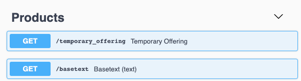

## Introductie

In dit document beschrijven we best practices voor het ontwerpen van RESTful API's [[1]](#footnote-1) met een JSON payload. Bedoeling is dat iedereen functionele requirements kan omzetten in een RESTful API ontwerp. We noteren dit ontwerp in [Open API Specification v3.0.2](https://swagger.io/specification), zeg maar de opvolger van swagger.

### Enkele definities

Voor de eenvoud van het lezen van dit document hanteren we volgende afkortingen:

- **API:** als kortere notatie voor "RESTful API met JSON payloads". Ingeval we iets anders bedoelen (e.g. SOAP API), zullen we dat expliciet vermelden
- **Swagger:** Deze term wordt nog regelmatig gehanteerd en is net zoals OAS een notatievorm om RESTFul API's uit te drukken.
- **Swagger file:** "Kan je een swagger file bezorgen" hoor je nogal eens vaak bij Digipolis. Dit is een bestand in ofwel [YAML](http://yaml.org/spec/1.2/spec.html#id2802346) of [JSON](http://www.yaml.org/spec/1.2/spec.html#id2803231) formaat met hierin het ontwerp van de API.
- **OAS:** Ofwel [Open API Specification](https://swagger.io/specification), de opvolger van de swagger notatie. Zonder meer refereren we hier naar v3.

### Requirements vs Design

Digipolis heeft op Github haar [API Requirements](https://github.com/digipolisantwerpdocumentation/api-requirements) gedocumenteerd. Dit zijn een set van regels die we volgen zodat we consistente API's bekomen. Het geeft bijvoorbeeld aan [welke parameters moeten gebruikt worden voor paging](https://github.com/digipolisantwerpdocumentation/api-requirements#paginatie-query-parameters) of  welke [HTTP verbs](https://github.com/digipolisantwerpdocumentation/api-requirements#http-verbs-1) we hanteren en hun doel. De API requirements is een document dat vooral is gericht naar ontwikkelaars.

Het ontwerp van een API ofwel het "design" ervan beschrijft een set van best practices hoe je een functioneel onderwerp omzet naar een API. Zo wordt er o.a. ingegaan hoe je routes best inricht.

De meeste ontwikkelaars zijn bezig met de interne kant van een API. We zien vaak dat van daaruit de swagger files worden gegenereerd. Dit resulteert in soms nogal cryptische API's zoals het voorbeeld hieronder. De `GET /basetext` is een niet voor de hand liggende naam.

> #### Intuïtieve API's
> *...leggen zichzelf uit door de eenvoud en elegantie van hun ontwerp. Deze API's zijn ontworpen met een outside-in-business perspectief waardoor ze bijdragen aan een fluent Developer eXperience (DX) voor haar afnemers.*

### Opbouw van dit document

1. We starten met [enkele basisbegrippen](#2-enkele-basis-begrippen) en concepten die je moet kennen voor je een API kan ontwerpen

2. Als analist is het belangrijk dat je het functioneel domein in kaart brengt. In [hoofdstuk 3](#3-analyse-voorbereiding) werken we een voorbeeld uit in een UML class diagram.

3. We leren de taal waarin we een API kunnen beschrijven in [hoofdstuk 4](#4-ontwerpen-met-yaml-en-oas).

4. In [hoofdstuk 5](#5-api-ontwerp) gaan we het voorbeeld uit hoofdstuk 3 omzetten in een API. 

5. Als laatste sommen we nog enkele [API ontwerp principes](#6-api-ontwerp-principes) op.

---

1. We gebruiken de term RESTful API ook al zijn we hier niet 100% compatible met [level 3 van het Richardson Maturity Model](https://martinfowler.com/articles/richardsonMaturityModel.html). Onze API Requirements zorgen wel dat er de HAL standard wordt gevolgd voor het [Paged Responses](https://github.com/digipolisantwerpdocumentation/api-requirements#paginatie-response-bericht)
